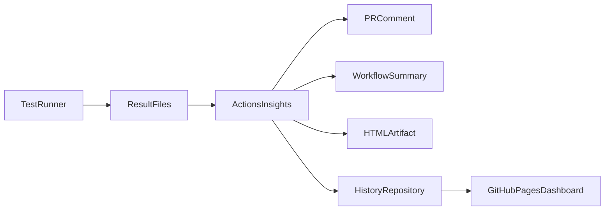

# Introduction

GitHub Actions makes it easy to run tests in CI, but **reporting test results is poor and difficult to understand at first glance**. When a workflow fails, you often have to trawl through build logs to find which tests failed and why.

**Actions Insights** fixes this problem by providing key information about your test run directly where you work — in pull requests, workflow summaries, and downloadable reports.

## What Actions Insights Does

Actions Insights is a GitHub Action you add as a step in your build pipeline. Your test runners continue to output results in their **native format** (TRX, JUnit XML, NUnit XML, xUnit XML). The action reads and parses those files, then optionally:

| Output | Description |
|--------|-------------|
| **PR comment** | A rich comment on the pull request listing failed tests, stack traces, and slow tests |
| **Workflow summary** | A result table in the workflow run's job summary |
| **HTML artifact** | A standalone responsive, interactive HTML report uploaded as a build artifact with basic test history |
| **History repository** | Structured JSON pushed to a separate git repository, powering a GitHub Pages dashboard across branches and repos |

Each output is **optional** and configured independently. PR comments only post when the workflow runs in a pull-request context.

## How It Works

1. Your tests run and write result files (e.g. `results.trx`, `test-results.xml`)
2. Actions Insights parses the files into a normalized test model
3. Results are published through your chosen output channels
4. Optionally, history data is pushed to a dedicated repository for org-wide dashboards

## Open Source & Privacy

Actions Insights is **Apache 2.0 licensed** and fully open source. The optional history repository is hosted within **your** organisation or user account on GitHub — your test data never leaves GitHub or your ownership.

## Next Steps

- **[AI Setup Guide](./setup/ai-setup)** — ask your AI assistant to set this up for you
- **[Quick Start](./setup/quick-start)** — add Actions Insights to your workflow in minutes
- **[Choose Your Outputs](./setup/choose-outputs)** — configure only the reporting channels you need
- **[Configuration Reference](./reference/configuration)** — full input/output reference
